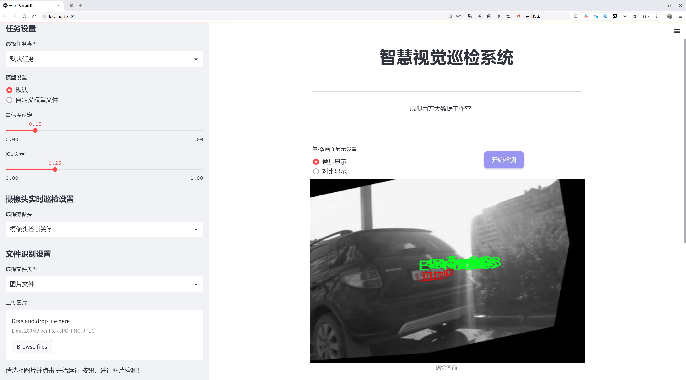
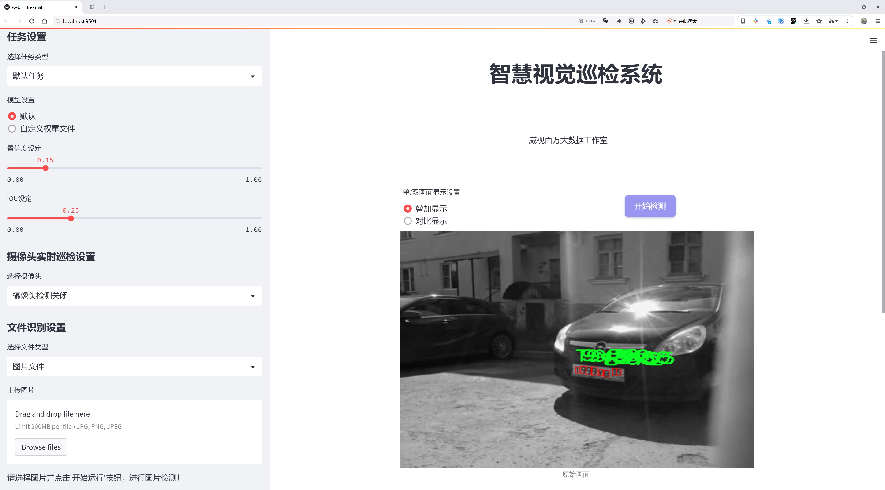
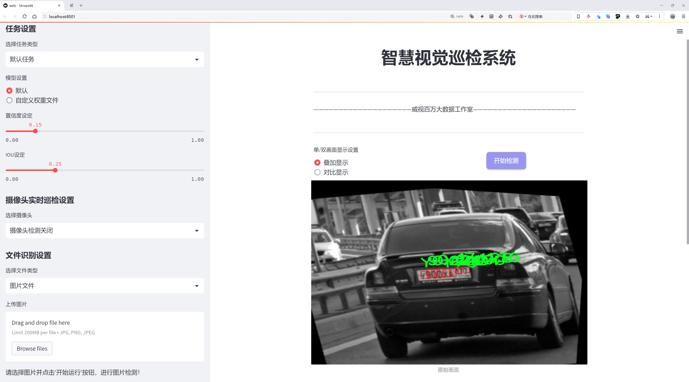
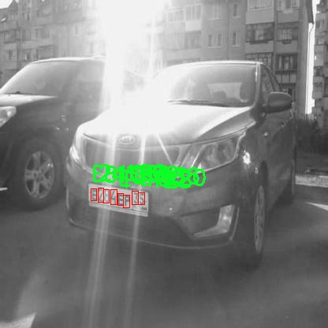
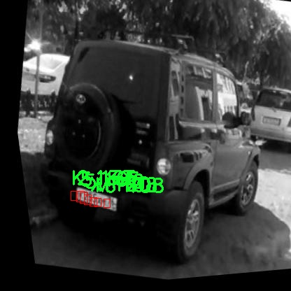
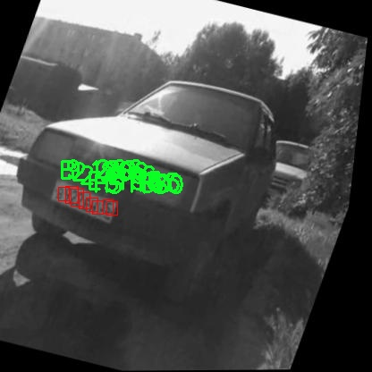
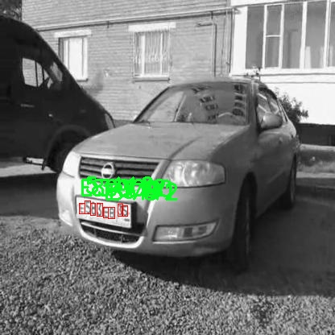
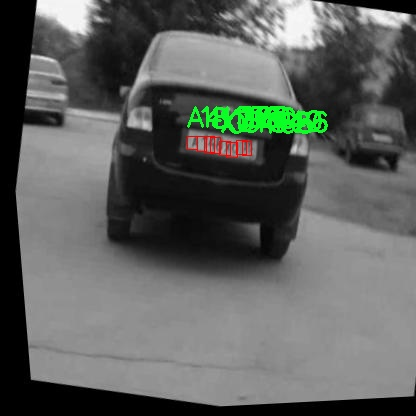

# 车牌号字符检测系统源码分享
 # [一条龙教学YOLOV8标注好的数据集一键训练_70+全套改进创新点发刊_Web前端展示]

### 1.研究背景与意义

项目参考[AAAI Association for the Advancement of Artificial Intelligence](https://gitee.com/qunmasj/projects)

研究背景与意义

随着智能交通系统的快速发展，车牌号字符检测技术在车辆识别、交通管理、停车场管理等领域的应用愈发广泛。车牌作为车辆的唯一标识，其信息的准确获取对于交通监控、违章查询、车辆追踪等具有重要意义。传统的车牌识别方法多依赖于图像处理技术，然而这些方法在复杂环境下的鲁棒性和准确性往往难以保证。近年来，深度学习技术的迅猛发展为车牌号字符检测提供了新的解决方案，尤其是基于卷积神经网络（CNN）的目标检测模型，如YOLO（You Only Look Once）系列，因其高效性和实时性受到广泛关注。

本研究旨在基于改进的YOLOv8模型，构建一个高效的车牌号字符检测系统。YOLOv8作为YOLO系列的最新版本，具备更强的特征提取能力和更快的推理速度，能够在复杂背景下实现高精度的目标检测。通过对YOLOv8的改进，我们期望能够进一步提升其在车牌字符检测中的表现，尤其是在低光照、模糊和遮挡等不利条件下的鲁棒性。

在数据集方面，本研究将使用包含8080张图像的GRZ数据集，该数据集涵盖了24个类别的字符，包括数字0-9和字母A-Y。数据集的多样性和丰富性为模型的训练提供了良好的基础，能够有效提高模型对不同字符的识别能力。尤其是在车牌字符识别中，字符的形状、颜色、大小和排列方式各异，数据集的多样性将有助于模型学习到更为全面的特征，从而提升检测的准确性和稳定性。

此外，车牌号字符检测系统的研究不仅具有学术价值，也具备重要的社会意义。随着城市化进程的加快，交通管理面临着越来越大的挑战。高效的车牌识别系统能够为智能交通管理提供数据支持，帮助相关部门及时掌握交通状况，优化交通流量，减少交通拥堵。同时，在公共安全领域，车牌识别技术也能够协助警方快速定位可疑车辆，提高社会治安水平。

综上所述，基于改进YOLOv8的车牌号字符检测系统的研究，不仅有助于推动目标检测技术的发展，也为智能交通系统的建设提供了重要的技术支持。通过对车牌字符的准确检测，我们期望能够为交通管理、公共安全等领域的实际应用提供有效的解决方案，推动相关技术的落地与应用。未来的研究将集中在模型的进一步优化、实时性提升以及在实际场景中的应用验证，以期实现更高效、更智能的车牌号字符检测系统。

### 2.图片演示







##### 注意：由于此博客编辑较早，上面“2.图片演示”和“3.视频演示”展示的系统图片或者视频可能为老版本，新版本在老版本的基础上升级如下：（实际效果以升级的新版本为准）

  （1）适配了YOLOV8的“目标检测”模型和“实例分割”模型，通过加载相应的权重（.pt）文件即可自适应加载模型。

  （2）支持“图片识别”、“视频识别”、“摄像头实时识别”三种识别模式。

  （3）支持“图片识别”、“视频识别”、“摄像头实时识别”三种识别结果保存导出，解决手动导出（容易卡顿出现爆内存）存在的问题，识别完自动保存结果并导出到。

  （4）支持Web前端系统中的标题、背景图等自定义修改，后面提供修改教程。

  另外本项目提供训练的数据集和训练教程,暂不提供权重文件（best.pt）,需要您按照教程进行训练后实现图片演示和Web前端界面演示的效果。

### 3.视频演示

[3.1 视频演示](https://www.bilibili.com/video/BV1hmWDejE4J/?vd_source=ff015de2d29cbe2a9cdbfa7064407a08)

### 4.数据集信息展示

数据集信息展示

本数据集名为GRZ，专为改进YOLOv8的车牌号字符检测系统而设计，包含了丰富的图像和多样的类别信息，旨在提升模型在实际应用中的准确性和鲁棒性。数据集中总共有8080张图像，这些图像涵盖了多种场景和环境，以确保模型能够在不同的条件下进行有效的字符识别。数据集的多样性不仅体现在图像数量上，还体现在类别的丰富性上，共包含24个类别，这些类别涵盖了从数字到字母的所有可能字符，具体包括0到9的数字以及A到Y的字母，确保了对车牌号字符的全面覆盖。

在实际应用中，车牌号的字符识别面临着多种挑战，例如不同的字体、颜色、背景复杂度以及光照条件等。为此，GRZ数据集特别注重图像的多样性和复杂性，以便训练出的YOLOv8模型能够适应各种实际场景。每一类字符的样本数量均衡，确保模型在训练过程中不会偏向某一特定字符，从而提高整体的识别精度。数据集中包含的字符类别从数字0到9，再到字母A、B、C、D、E、GRZ、H、K、M、O、P、T、X、Y等，涵盖了车牌号中可能出现的所有字符，充分考虑了不同地区和国家的车牌设计特点。

数据集的图像来源于真实场景拍摄，具有较高的真实性和实用性。为了确保数据集的质量，所有图像均经过严格筛选，去除了模糊、重复和不相关的图像，使得训练数据更加精炼。此外，数据集还提供了详细的标注信息，标注格式符合YOLO模型的要求，便于直接用于模型训练。标注的准确性和一致性是提升模型性能的关键，因此在数据准备阶段，采用了专业的标注工具和流程，确保每个字符的标注都符合标准。

该数据集的使用许可为CC BY 4.0，允许用户在遵循相关条款的前提下自由使用和修改数据集。这种开放的许可方式鼓励研究人员和开发者在车牌号字符检测领域进行更深入的研究和探索，推动技术的进步与应用的普及。

综上所述，GRZ数据集为改进YOLOv8的车牌号字符检测系统提供了坚实的基础，凭借其丰富的图像资源和全面的字符类别，能够有效提升模型的训练效果和识别能力。通过对该数据集的充分利用，研究人员可以在车牌号识别技术上取得更大的突破，为智能交通系统的建设和发展贡献力量。











### 5.全套项目环境部署视频教程（零基础手把手教学）

[5.1 环境部署教程链接（零基础手把手教学）](https://www.ixigua.com/7404473917358506534?logTag=c807d0cbc21c0ef59de5)


[5.2 安装Python虚拟环境创建和依赖库安装视频教程链接（零基础手把手教学）](https://www.ixigua.com/7404474678003106304?logTag=1f1041108cd1f708b01a)

### 6.手把手YOLOV8训练视频教程（零基础小白有手就能学会）

[6.1 环境部署教程链接（零基础手把手教学）](https://www.ixigua.com/7404477157818401292?logTag=d31a2dfd1983c9668658)

### 7.70+种全套YOLOV8创新点代码加载调参视频教程（一键加载写好的改进模型的配置文件）

[7.1 环境部署教程链接（零基础手把手教学）](https://www.ixigua.com/7404478314661806627?logTag=29066f8288e3f4eea3a4)

### 8.70+种全套YOLOV8创新点原理讲解（非科班也可以轻松写刊发刊，V10版本正在科研待更新）

由于篇幅限制，每个创新点的具体原理讲解就不一一展开，具体见下列网址中的创新点对应子项目的技术原理博客网址【Blog】：


[8.1 70+种全套YOLOV8创新点原理讲解链接](https://gitee.com/qunmasj/good)

### 9.系统功能展示（检测对象为举例，实际内容以本项目数据集为准）

图1.系统支持检测结果表格显示

  图2.系统支持置信度和IOU阈值手动调节

  图3.系统支持自定义加载权重文件best.pt(需要你通过步骤5中训练获得)

  图4.系统支持摄像头实时识别

  图5.系统支持图片识别

  图6.系统支持视频识别

  图7.系统支持识别结果文件自动保存

  图8.系统支持Excel导出检测结果数据


### 10.原始YOLOV8算法原理

原始YOLOv8算法原理

YOLOv8作为目标检测领域的最新进展，延续了YOLO系列算法的优良传统，同时在多个方面进行了创新与优化。该算法的核心思想依然是通过单一的神经网络实现目标的快速检测与分类，然而在具体的网络结构与训练策略上，YOLOv8引入了许多新颖的设计，使其在性能和效率上都得到了显著提升。

YOLOv8的网络结构主要分为三个部分：Backbone、Neck和Head。Backbone部分负责特征提取，Neck部分用于特征融合，而Head部分则是最终的目标检测与分类模块。整体上，YOLOv8的设计旨在通过高效的特征提取和融合，提升模型对不同尺度目标的检测能力。

在Backbone部分，YOLOv8采用了一系列卷积和反卷积层来提取图像特征。与以往的YOLO版本相比，YOLOv8引入了C2模块作为基本构成单元，这一模块结合了残差连接和瓶颈结构，旨在减小网络的参数量，同时提升特征提取的效率。具体而言，Backbone由5个CBS模块、4个C2f模块和1个快速空间金字塔池化（SPPF）模块组成。C2f模块的设计灵感来源于YOLOv7中的E-ELAN结构，通过跨层分支连接来增强模型的梯度流，从而改善检测结果。这种设计使得YOLOv8在保持轻量化的同时，能够获得更丰富的特征信息。

Neck部分则采用了多尺度特征融合技术，旨在将来自Backbone不同阶段的特征图进行有效融合，以便更好地捕捉不同尺度目标的信息。具体来说，YOLOv8利用了FPNS（Feature Pyramid Network）和PAN（Path Aggregation Network）结构，将不同层次的特征进行整合，提升了目标检测的性能和鲁棒性。这种特征融合的策略使得YOLOv8能够在复杂场景中更准确地识别和定位目标，尤其是在目标尺寸差异较大的情况下。

在Head部分，YOLOv8负责最终的目标检测和分类任务。该部分设有三个检测头，分别用于处理不同尺寸的信息。检测头内部包含一系列卷积层和反卷积层，通过这些层的组合，YOLOv8能够生成高质量的检测结果。值得注意的是，YOLOv8采用了解耦的检测头结构，将分类和回归任务分开处理。这一设计的优势在于可以更好地优化每个任务的损失函数，从而提升整体检测性能。此外，YOLOv8还将传统的Anchor-Based检测方法替换为Anchor-Free策略，进一步简化了模型的复杂性，并提高了检测的灵活性。

在训练过程中，YOLOv8采用了一系列创新的数据增强策略，以提升模型的泛化能力。例如，在训练的最后10个epoch中，YOLOv8关闭了马赛克增强，这一策略有助于模型在面对不同类型的图像时，能够更好地适应和学习。同时，YOLOv8引入了动态Task-Aligned Assigner样本分配策略，以优化训练样本的选择，从而提高训练效率和模型性能。

在损失计算方面，YOLOv8采用了BCELoss作为分类损失，而回归损失则结合了DFLLoss和CIoULoss。这种损失函数的设计使得模型在训练过程中能够更好地平衡分类与回归任务的优化，进而提升检测的准确性。

总体而言，YOLOv8在设计上充分考虑了目标检测的实际需求，通过高效的网络结构和创新的训练策略，使得模型在多种应用场景中表现出色。其多种网络结构的选择（如YOLOv8n、YOLOv8s、YOLOv8m、YOLOv8l和YOLOv8x）为不同场景的需求提供了灵活的解决方案，用户可以根据具体的应用需求选择合适的模型，从而实现最佳的检测效果。

通过对YOLOv8算法原理的深入分析，可以看出其在目标检测领域的巨大潜力与应用价值。无论是在实时监控、自动驾驶还是智能安防等领域，YOLOv8都能够凭借其高效的检测能力和优越的性能，成为推动相关技术进步的重要力量。随着YOLOv8的不断发展与完善，未来在目标检测的研究与应用中，必将迎来更多的创新与突破。


### 11.项目核心源码讲解（再也不用担心看不懂代码逻辑）

#### 11.1 ultralytics\utils\plotting.py

以下是经过精简和注释的核心代码部分，主要包括 `Colors` 和 `Annotator` 类的实现，以及一些重要的函数。这些部分是整个代码的核心，负责颜色管理和图像注释功能。

```python
import numpy as np
from PIL import Image, ImageDraw, ImageFont
import cv2

class Colors:
    """
    颜色管理类，提供颜色调色板和颜色转换功能。
    """

    def __init__(self):
        """初始化颜色调色板，使用16种预定义的颜色。"""
        hexs = (
            "FF3838", "FF9D97", "FF701F", "FFB21D", "CFD231",
            "48F90A", "92CC17", "3DDB86", "1A9334", "00D4BB",
            "2C99A8", "00C2FF", "344593", "6473FF", "0018EC",
            "8438FF", "520085", "CB38FF", "FF95C8", "FF37C7",
        )
        # 将十六进制颜色转换为RGB格式
        self.palette = [self.hex2rgb(f"#{c}") for c in hexs]
        self.n = len(self.palette)  # 颜色数量

    def __call__(self, i, bgr=False):
        """根据索引返回颜色，支持BGR格式转换。"""
        c = self.palette[int(i) % self.n]
        return (c[2], c[1], c[0]) if bgr else c

    @staticmethod
    def hex2rgb(h):
        """将十六进制颜色转换为RGB元组。"""
        return tuple(int(h[1 + i : 1 + i + 2], 16) for i in (0, 2, 4))


class Annotator:
    """
    图像注释类，用于在图像上绘制边框、文本和关键点。
    """

    def __init__(self, im, line_width=None, font_size=None, font="Arial.ttf", pil=False):
        """初始化Annotator类，设置图像和绘制参数。"""
        self.im = im if isinstance(im, Image.Image) else Image.fromarray(im)
        self.draw = ImageDraw.Draw(self.im)
        self.lw = line_width or 2  # 默认线宽
        self.font = ImageFont.truetype(font, font_size or 12)  # 字体设置

    def box_label(self, box, label="", color=(128, 128, 128), txt_color=(255, 255, 255)):
        """在图像上绘制边框和标签。"""
        # 绘制矩形框
        self.draw.rectangle(box, width=self.lw, outline=color)
        if label:
            # 获取文本大小并绘制背景
            w, h = self.draw.textsize(label, font=self.font)
            self.draw.rectangle((box[0], box[1] - h, box[0] + w, box[1]), fill=color)
            self.draw.text((box[0], box[1] - h), label, fill=txt_color, font=self.font)

    def kpts(self, kpts, radius=5):
        """在图像上绘制关键点。"""
        for k in kpts:
            x, y = int(k[0]), int(k[1])
            self.draw.ellipse((x - radius, y - radius, x + radius, y + radius), fill=(255, 0, 0))

    def result(self):
        """返回注释后的图像。"""
        return np.asarray(self.im)

# 使用示例
# colors = Colors()
# annotator = Annotator(image)
# annotator.box_label([50, 50, 100, 100], label="Object", color=colors(0))
# annotated_image = annotator.result()
```

### 代码注释说明：

1. **Colors 类**：
   - 负责管理颜色调色板，提供从十六进制颜色到RGB的转换功能。
   - `__call__` 方法允许通过索引获取颜色，支持BGR格式的转换。

2. **Annotator 类**：
   - 负责在图像上绘制边框、文本和关键点。
   - `box_label` 方法绘制矩形框和标签。
   - `kpts` 方法绘制关键点，使用红色圆圈表示。

3. **使用示例**：
   - 展示如何创建 `Colors` 和 `Annotator` 的实例，并在图像上绘制注释。

以上是代码的核心部分和详细注释，提供了对颜色和图像注释的基本功能。

这个文件是一个用于图像处理和可视化的Python模块，主要与Ultralytics YOLO（You Only Look Once）模型相关。文件中包含了多个类和函数，旨在为图像标注、绘图、特征可视化等提供支持。

首先，文件导入了一些必要的库，包括`cv2`（OpenCV）、`matplotlib`、`numpy`、`torch`等，这些库为图像处理和绘图提供了基础功能。接着，定义了一个`Colors`类，用于管理颜色调色板。这个类提供了将十六进制颜色代码转换为RGB值的方法，并初始化了一组预定义的颜色，用于后续的图像标注。

接下来是`Annotator`类，它是一个用于在图像上绘制标注的工具。该类支持使用PIL或OpenCV进行绘制，能够绘制矩形框、文本、关键点、掩膜等。`Annotator`类的构造函数接收图像、线宽、字体等参数，并根据这些参数初始化绘图环境。该类中包含的方法允许用户在图像上添加边框、文本、关键点和其他注释信息。

在`Annotator`类中，`box_label`方法用于在图像上绘制带标签的矩形框，`masks`方法用于在图像上绘制掩膜，`kpts`方法用于绘制关键点及其连接线，`rectangle`和`text`方法则用于绘制矩形和文本。还有一些方法用于绘制特定的区域、轨迹、计数等。

文件中还定义了一些用于绘制和保存图像的函数。例如，`plot_labels`函数用于绘制训练标签的直方图和统计信息，`save_one_box`函数用于根据给定的边界框从图像中裁剪并保存图像，`plot_images`函数用于绘制图像网格并标注。

此外，还有一些用于绘制训练结果的函数，如`plot_results`和`plot_tune_results`，它们可以从CSV文件中读取数据并生成相应的图表。`output_to_target`和`output_to_rotated_target`函数则用于将模型输出转换为可用于绘图的目标格式。

最后，文件中还包含了特征可视化的功能，允许用户在推理过程中可视化模型模块的特征图。这对于理解模型的内部工作原理和调试非常有帮助。

总体而言，这个文件提供了一整套用于图像标注、绘图和结果可视化的工具，方便用户在使用YOLO模型进行目标检测时进行分析和展示。

#### 11.2 ui.py

```python
import sys
import subprocess

def run_script(script_path):
    """
    使用当前 Python 环境运行指定的脚本。

    Args:
        script_path (str): 要运行的脚本路径

    Returns:
        None
    """
    # 获取当前 Python 解释器的路径
    python_path = sys.executable

    # 构建运行命令，使用 streamlit 运行指定的脚本
    command = f'"{python_path}" -m streamlit run "{script_path}"'

    # 执行命令
    result = subprocess.run(command, shell=True)
    # 检查命令执行的返回码，0 表示成功，非0表示出错
    if result.returncode != 0:
        print("脚本运行出错。")

# 实例化并运行应用
if __name__ == "__main__":
    # 指定要运行的脚本路径
    script_path = "web.py"  # 假设脚本在当前目录下

    # 运行脚本
    run_script(script_path)
```

### 代码核心部分及注释说明：

1. **导入模块**：
   - `sys`：用于获取当前 Python 解释器的路径。
   - `subprocess`：用于执行外部命令。

2. **定义 `run_script` 函数**：
   - 此函数接收一个参数 `script_path`，表示要运行的 Python 脚本的路径。
   - 使用 `sys.executable` 获取当前 Python 解释器的路径，以确保使用正确的 Python 环境来运行脚本。
   - 构建命令字符串，使用 `streamlit` 模块运行指定的脚本。
   - 使用 `subprocess.run` 执行构建的命令，并通过 `shell=True` 允许在 shell 中执行。
   - 检查命令的返回码，如果返回码不为 0，表示脚本运行出错，打印错误信息。

3. **主程序入口**：
   - 使用 `if __name__ == "__main__":` 确保该代码块仅在直接运行脚本时执行。
   - 指定要运行的脚本路径为 `web.py`。
   - 调用 `run_script` 函数来执行指定的脚本。

这个程序文件的主要功能是使用当前的 Python 环境来运行一个指定的脚本，具体来说是运行一个名为 `web.py` 的脚本。程序首先导入了必要的模块，包括 `sys`、`os` 和 `subprocess`，以及一个自定义的 `abs_path` 函数，用于获取脚本的绝对路径。

在 `run_script` 函数中，首先获取当前 Python 解释器的路径，这通过 `sys.executable` 实现。接着，构建一个命令字符串，该命令使用 `streamlit` 模块来运行指定的脚本。命令的格式是将 Python 解释器的路径与 `-m streamlit run` 和脚本路径结合起来，形成一个完整的命令。

随后，使用 `subprocess.run` 方法来执行这个命令。`shell=True` 参数表示在一个新的 shell 中执行命令。执行完命令后，程序检查返回的状态码，如果返回码不为零，表示脚本运行过程中出现了错误，此时会打印出“脚本运行出错”的提示信息。

在文件的最后部分，使用 `if __name__ == "__main__":` 语句来确保只有在直接运行该脚本时才会执行后面的代码。这里指定了要运行的脚本路径为 `web.py`，并调用 `run_script` 函数来执行这个脚本。

总的来说，这个程序的功能是提供一个简单的接口，通过命令行运行一个 Streamlit 应用脚本，并处理可能出现的错误。

#### 11.3 ultralytics\utils\benchmarks.py

以下是代码中最核心的部分，并附上详细的中文注释：

```python
import time
import numpy as np
import torch.cuda
from ultralytics import YOLO
from ultralytics.utils import LOGGER, select_device

def benchmark(
    model='yolov8n.pt', data=None, imgsz=160, half=False, int8=False, device="cpu", verbose=False
):
    """
    基准测试 YOLO 模型在不同格式下的速度和准确性。

    参数:
        model (str | Path | optional): 模型文件或目录的路径，默认为 'yolov8n.pt'。
        data (str, optional): 要评估的数据集，默认为 None。
        imgsz (int, optional): 基准测试的图像大小，默认为 160。
        half (bool, optional): 如果为 True，则使用半精度模型，默认为 False。
        int8 (bool, optional): 如果为 True，则使用 int8 精度模型，默认为 False。
        device (str, optional): 运行基准测试的设备，可以是 'cpu' 或 'cuda'，默认为 'cpu'。
        verbose (bool | float | optional): 如果为 True 或浮点数，则在给定指标下断言基准测试通过，默认为 False。

    返回:
        df (pandas.DataFrame): 包含每种格式的基准测试结果的 pandas DataFrame，包括文件大小、指标和推理时间。
    """
    
    import pandas as pd

    # 设置 pandas 显示选项
    pd.options.display.max_columns = 10
    pd.options.display.width = 120
    
    # 选择设备
    device = select_device(device, verbose=False)
    
    # 加载模型
    model = YOLO(model) if isinstance(model, (str, Path)) else model

    results = []  # 存储结果的列表
    start_time = time.time()  # 记录开始时间
    
    # 遍历不同的导出格式
    for i, (name, format, suffix, cpu, gpu) in export_formats().iterrows():
        emoji, filename = "❌", None  # 默认导出状态为失败
        try:
            # 检查导出格式的兼容性
            if i in {5, 10}:  # CoreML 和 TF.js
                assert MACOS or LINUX, "导出仅支持 macOS 和 Linux"
            if "cpu" in device.type:
                assert cpu, "CPU 不支持推理"
            if "cuda" in device.type:
                assert gpu, "GPU 不支持推理"

            # 导出模型
            if format == "-":
                filename = model.ckpt_path or model.cfg  # PyTorch 格式
                exported_model = model  # 直接使用 PyTorch 模型
            else:
                filename = model.export(imgsz=imgsz, format=format, half=half, int8=int8, device=device, verbose=False)
                exported_model = YOLO(filename, task=model.task)  # 加载导出的模型
                assert suffix in str(filename), "导出失败"
            emoji = "✅"  # 导出成功

            # 进行推理
            exported_model.predict(ASSETS / "bus.jpg", imgsz=imgsz, device=device, half=half)

            # 验证模型
            data = data or TASK2DATA[model.task]  # 使用默认数据集
            key = TASK2METRIC[model.task]  # 获取对应的指标
            results_dict = exported_model.val(
                data=data, batch=1, imgsz=imgsz, plots=False, device=device, half=half, int8=int8, verbose=False
            )
            metric, speed = results_dict.results_dict[key], results_dict.speed["inference"]
            results.append([name, "✅", round(file_size(filename), 1), round(metric, 4), round(speed, 2)])
        except Exception as e:
            LOGGER.warning(f"ERROR ❌️ 基准测试失败: {name}: {e}")
            results.append([name, emoji, round(file_size(filename), 1), None, None])  # 记录失败结果

    # 打印结果
    df = pd.DataFrame(results, columns=["格式", "状态", "大小 (MB)", key, "推理时间 (ms/im)"])
    LOGGER.info(f"\n基准测试完成，结果如下:\n{df}\n")
    
    return df
```

### 代码核心部分解释：
1. **导入必要的库**：导入了 `time`、`numpy` 和 `torch.cuda` 等库，以及 YOLO 模型和一些工具函数。
2. **benchmark 函数**：该函数用于对 YOLO 模型进行基准测试，支持多种格式的导出和推理。
3. **参数说明**：函数参数包括模型路径、数据集、图像大小、精度设置、设备类型等。
4. **选择设备**：根据用户输入选择 CPU 或 GPU 作为运行设备。
5. **导出模型**：根据不同的格式导出模型，并进行推理和验证。
6. **结果记录**：将每种格式的测试结果记录到列表中，并最终返回一个 DataFrame 格式的结果。

这个程序文件 `ultralytics/utils/benchmarks.py` 是用于基准测试 YOLO 模型的性能，包括速度和准确性。它提供了一个接口来评估不同格式的模型在特定数据集上的表现，并生成相关的基准测试结果。

文件的开头部分包含了使用说明，用户可以通过导入 `ProfileModels` 和 `benchmark` 函数来进行模型的基准测试。用户可以通过传入不同的模型配置文件（如 `yolov8n.yaml`）或模型权重文件（如 `yolov8n.pt`）来进行性能评估。程序支持多种模型格式，包括 PyTorch、ONNX、TensorRT 等，并列出了各格式对应的模型文件。

`benchmark` 函数是主要的基准测试函数，它接受多个参数，包括模型路径、数据集、图像大小、是否使用半精度和整数量化等。函数内部会根据传入的模型路径加载模型，并对不同格式的模型进行导出和推理。它会记录每种格式的文件大小、性能指标（如 mAP）和推理时间，并将结果以 pandas DataFrame 的形式返回。

在 `benchmark` 函数中，首先会导入必要的库，并设置设备（CPU 或 GPU）。然后，通过 `export_formats` 函数获取支持的模型格式，并对每种格式进行循环处理。对于每种格式，程序会尝试导出模型，并进行推理测试。推理的结果会被记录下来，包括成功与否、文件大小、性能指标和推理时间。如果在导出或推理过程中出现错误，程序会记录警告信息。

`ProfileModels` 类则是用于对不同模型进行性能分析的工具。它接受一个模型路径列表，并提供了一些配置参数，如定时运行次数、预热运行次数、最小运行时间和图像大小等。该类的 `profile` 方法会遍历给定的模型文件，导出 ONNX 和 TensorRT 格式的模型，并对它们进行性能测试。性能测试的结果会以表格的形式输出，包括每个模型的速度、参数数量和计算量（FLOPs）等信息。

此外，程序中还实现了一些辅助函数，如 `get_files` 用于获取指定路径下的模型文件，`get_onnx_model_info` 用于获取 ONNX 模型的信息，`iterative_sigma_clipping` 用于处理运行时间数据以去除异常值，`profile_tensorrt_model` 和 `profile_onnx_model` 分别用于对 TensorRT 和 ONNX 模型进行性能分析。

总的来说，这个文件为 YOLO 模型的性能评估提供了一个全面的框架，用户可以方便地对不同格式的模型进行基准测试，并获取详细的性能指标。

#### 11.4 train.py

以下是经过简化并添加详细中文注释的核心代码部分：

```python
import os
import torch
import yaml
from ultralytics import YOLO  # 导入YOLO模型

# 设置设备为GPU（如果可用），否则使用CPU
device = "0" if torch.cuda.is_available() else "cpu"

if __name__ == '__main__':  # 确保该模块被直接运行时才执行以下代码
    workers = 1  # 设置数据加载的工作进程数
    batch = 2    # 设置每个批次的大小

    data_name = "data"  # 数据集名称
    # 获取数据集配置文件的绝对路径
    data_path = abs_path(f'datasets/{data_name}/{data_name}.yaml', path_type='current')  
    unix_style_path = data_path.replace(os.sep, '/')  # 将路径转换为Unix风格

    # 获取数据集目录路径
    directory_path = os.path.dirname(unix_style_path)
    
    # 读取YAML文件，保持原有顺序
    with open(data_path, 'r') as file:
        data = yaml.load(file, Loader=yaml.FullLoader)
    
    # 如果YAML文件中有'path'项，则修改为当前目录路径
    if 'path' in data:
        data['path'] = directory_path
        # 将修改后的数据写回YAML文件
        with open(data_path, 'w') as file:
            yaml.safe_dump(data, file, sort_keys=False)

    # 加载预训练的YOLOv8模型
    model = YOLO(model='./ultralytics/cfg/models/v8/yolov8s.yaml', task='detect')  
    
    # 开始训练模型
    results2 = model.train(
        data=data_path,  # 指定训练数据的配置文件路径
        device=device,    # 指定使用的设备
        workers=workers,  # 指定数据加载的工作进程数
        imgsz=640,        # 指定输入图像的大小为640x640
        epochs=100,       # 指定训练100个epoch
        batch=batch,      # 指定每个批次的大小
        name='train_v8_' + data_name  # 指定训练任务的名称
    )
```

### 代码注释说明：
1. **导入必要的库**：导入`os`、`torch`、`yaml`和`YOLO`模型。
2. **设备选择**：根据是否有可用的GPU来选择设备。
3. **主程序入口**：确保代码在直接运行时执行。
4. **参数设置**：设置数据加载的工作进程数和批次大小。
5. **数据集路径处理**：获取数据集配置文件的绝对路径，并将其转换为Unix风格的路径。
6. **读取和修改YAML文件**：读取数据集的YAML配置文件，修改其中的`path`项为当前目录路径，并将修改后的内容写回文件。
7. **模型加载**：加载预训练的YOLOv8模型，准备进行训练。
8. **模型训练**：调用`train`方法开始训练，指定训练数据、设备、工作进程数、图像大小、训练轮数、批次大小和任务名称。

该程序文件 `train.py` 是一个用于训练 YOLOv8 模型的脚本。首先，程序导入了必要的库，包括 `os`、`torch`、`yaml` 和 `ultralytics` 中的 YOLO 模型。接着，程序检查当前是否有可用的 GPU，如果有，则将设备设置为 "0"（即使用第一个 GPU），否则使用 CPU。

在 `__main__` 块中，程序首先定义了一些训练参数，包括工作进程数 `workers` 和批次大小 `batch`。接下来，指定了数据集的名称 `data_name`，并构建了数据集 YAML 文件的绝对路径。使用 `abs_path` 函数来获取该路径，并将路径中的分隔符替换为 Unix 风格的分隔符。

程序获取了数据集目录的路径，并打开指定的 YAML 文件以读取数据。读取后，程序检查 YAML 数据中是否包含 `path` 项，如果有，则将其修改为当前目录路径，并将修改后的数据写回到 YAML 文件中。

接下来，程序加载了预训练的 YOLOv8 模型，指定了模型的配置文件。然后，调用 `model.train` 方法开始训练模型。在训练过程中，程序指定了训练数据的配置文件路径、设备、工作进程数、输入图像的大小（640x640）、训练的 epoch 数（100）以及训练任务的名称。

整体来看，该脚本的功能是配置并启动 YOLOv8 模型的训练过程，确保数据集路径正确，并允许用户根据需要调整训练参数。

#### 11.5 ultralytics\utils\tal.py

以下是代码中最核心的部分，并附上详细的中文注释：

```python
import torch
import torch.nn as nn

class TaskAlignedAssigner(nn.Module):
    """
    任务对齐分配器，用于目标检测。

    该类根据任务对齐度量将真实目标（gt）分配给锚框，结合了分类和定位信息。
    """

    def __init__(self, topk=13, num_classes=80, alpha=1.0, beta=6.0, eps=1e-9):
        """初始化任务对齐分配器对象，设置可调超参数。"""
        super().__init__()
        self.topk = topk  # 考虑的前k个候选框数量
        self.num_classes = num_classes  # 目标类别数量
        self.bg_idx = num_classes  # 背景类别索引
        self.alpha = alpha  # 分类部分的超参数
        self.beta = beta  # 定位部分的超参数
        self.eps = eps  # 防止除以零的小值

    @torch.no_grad()
    def forward(self, pd_scores, pd_bboxes, anc_points, gt_labels, gt_bboxes, mask_gt):
        """
        计算任务对齐分配。

        参数:
            pd_scores (Tensor): 预测的分数，形状为(bs, num_total_anchors, num_classes)
            pd_bboxes (Tensor): 预测的边界框，形状为(bs, num_total_anchors, 4)
            anc_points (Tensor): 锚框中心点，形状为(num_total_anchors, 2)
            gt_labels (Tensor): 真实目标标签，形状为(bs, n_max_boxes, 1)
            gt_bboxes (Tensor): 真实目标边界框，形状为(bs, n_max_boxes, 4)
            mask_gt (Tensor): 真实目标掩码，形状为(bs, n_max_boxes, 1)

        返回:
            target_labels (Tensor): 目标标签，形状为(bs, num_total_anchors)
            target_bboxes (Tensor): 目标边界框，形状为(bs, num_total_anchors, 4)
            target_scores (Tensor): 目标分数，形状为(bs, num_total_anchors, num_classes)
            fg_mask (Tensor): 前景掩码，形状为(bs, num_total_anchors)
            target_gt_idx (Tensor): 目标索引，形状为(bs, num_total_anchors)
        """
        self.bs = pd_scores.size(0)  # 批次大小
        self.n_max_boxes = gt_bboxes.size(1)  # 最大目标数量

        if self.n_max_boxes == 0:  # 如果没有真实目标
            device = gt_bboxes.device
            return (
                torch.full_like(pd_scores[..., 0], self.bg_idx).to(device),  # 目标标签全为背景
                torch.zeros_like(pd_bboxes).to(device),  # 目标边界框全为零
                torch.zeros_like(pd_scores).to(device),  # 目标分数全为零
                torch.zeros_like(pd_scores[..., 0]).to(device),  # 前景掩码全为零
                torch.zeros_like(pd_scores[..., 0]).to(device),  # 目标索引全为零
            )

        # 获取正样本掩码、对齐度量和重叠度
        mask_pos, align_metric, overlaps = self.get_pos_mask(
            pd_scores, pd_bboxes, gt_labels, gt_bboxes, anc_points, mask_gt
        )

        # 选择重叠度最高的目标
        target_gt_idx, fg_mask, mask_pos = self.select_highest_overlaps(mask_pos, overlaps, self.n_max_boxes)

        # 获取分配的目标
        target_labels, target_bboxes, target_scores = self.get_targets(gt_labels, gt_bboxes, target_gt_idx, fg_mask)

        # 归一化对齐度量
        align_metric *= mask_pos
        pos_align_metrics = align_metric.amax(dim=-1, keepdim=True)  # 计算正样本的最大对齐度量
        pos_overlaps = (overlaps * mask_pos).amax(dim=-1, keepdim=True)  # 计算正样本的最大重叠度
        norm_align_metric = (align_metric * pos_overlaps / (pos_align_metrics + self.eps)).amax(-2).unsqueeze(-1)
        target_scores = target_scores * norm_align_metric  # 更新目标分数

        return target_labels, target_bboxes, target_scores, fg_mask.bool(), target_gt_idx

    def get_pos_mask(self, pd_scores, pd_bboxes, gt_labels, gt_bboxes, anc_points, mask_gt):
        """获取正样本掩码。"""
        mask_in_gts = self.select_candidates_in_gts(anc_points, gt_bboxes)  # 选择在真实目标中的候选锚框
        align_metric, overlaps = self.get_box_metrics(pd_scores, pd_bboxes, gt_labels, gt_bboxes, mask_in_gts * mask_gt)  # 计算对齐度量和重叠度
        mask_topk = self.select_topk_candidates(align_metric, topk_mask=mask_gt.expand(-1, -1, self.topk).bool())  # 选择前k个候选框
        mask_pos = mask_topk * mask_in_gts * mask_gt  # 合并所有掩码

        return mask_pos, align_metric, overlaps

    def get_box_metrics(self, pd_scores, pd_bboxes, gt_labels, gt_bboxes, mask_gt):
        """计算预测和真实边界框的对齐度量。"""
        na = pd_bboxes.shape[-2]  # 锚框数量
        mask_gt = mask_gt.bool()  # 转换为布尔类型掩码
        overlaps = torch.zeros([self.bs, self.n_max_boxes, na], dtype=pd_bboxes.dtype, device=pd_bboxes.device)  # 初始化重叠度
        bbox_scores = torch.zeros([self.bs, self.n_max_boxes, na], dtype=pd_scores.dtype, device=pd_scores.device)  # 初始化边界框分数

        ind = torch.zeros([2, self.bs, self.n_max_boxes], dtype=torch.long)  # 初始化索引
        ind[0] = torch.arange(end=self.bs).view(-1, 1).expand(-1, self.n_max_boxes)  # 批次索引
        ind[1] = gt_labels.squeeze(-1)  # 真实目标标签索引
        bbox_scores[mask_gt] = pd_scores[ind[0], :, ind[1]][mask_gt]  # 获取每个真实目标的分数

        # 计算重叠度
        pd_boxes = pd_bboxes.unsqueeze(1).expand(-1, self.n_max_boxes, -1, -1)[mask_gt]
        gt_boxes = gt_bboxes.unsqueeze(2).expand(-1, -1, na, -1)[mask_gt]
        overlaps[mask_gt] = self.iou_calculation(gt_boxes, pd_boxes)  # 计算IoU

        align_metric = bbox_scores.pow(self.alpha) * overlaps.pow(self.beta)  # 计算对齐度量
        return align_metric, overlaps

    def iou_calculation(self, gt_bboxes, pd_bboxes):
        """计算边界框的IoU。"""
        return bbox_iou(gt_bboxes, pd_bboxes, xywh=False, CIoU=True).squeeze(-1).clamp_(0)  # 计算IoU并限制在0到1之间

    def select_topk_candidates(self, metrics, largest=True, topk_mask=None):
        """根据给定的度量选择前k个候选框。"""
        topk_metrics, topk_idxs = torch.topk(metrics, self.topk, dim=-1, largest=largest)  # 获取前k个度量和索引
        if topk_mask is None:
            topk_mask = (topk_metrics.max(-1, keepdim=True)[0] > self.eps).expand_as(topk_idxs)  # 生成掩码
        topk_idxs.masked_fill_(~topk_mask, 0)  # 填充无效索引

        count_tensor = torch.zeros(metrics.shape, dtype=torch.int8, device=topk_idxs.device)  # 初始化计数张量
        ones = torch.ones_like(topk_idxs[:, :, :1], dtype=torch.int8, device=topk_idxs.device)  # 初始化全1张量
        for k in range(self.topk):
            count_tensor.scatter_add_(-1, topk_idxs[:, :, k : k + 1], ones)  # 统计每个候选框的出现次数
        count_tensor.masked_fill_(count_tensor > 1, 0)  # 过滤无效边界框

        return count_tensor.to(metrics.dtype)  # 返回计数张量

    def get_targets(self, gt_labels, gt_bboxes, target_gt_idx, fg_mask):
        """计算正样本的目标标签、边界框和分数。"""
        batch_ind = torch.arange(end=self.bs, dtype=torch.int64, device=gt_labels.device)[..., None]  # 批次索引
        target_gt_idx = target_gt_idx + batch_ind * self.n_max_boxes  # 计算目标索引
        target_labels = gt_labels.long().flatten()[target_gt_idx]  # 获取目标标签

        target_bboxes = gt_bboxes.view(-1, gt_bboxes.shape[-1])[target_gt_idx]  # 获取目标边界框

        target_labels.clamp_(0)  # 限制目标标签在有效范围内

        # 生成目标分数
        target_scores = torch.zeros(
            (target_labels.shape[0], target_labels.shape[1], self.num_classes),
            dtype=torch.int64,
            device=target_labels.device,
        )  # 初始化目标分数
        target_scores.scatter_(2, target_labels.unsqueeze(-1), 1)  # 根据目标标签生成分数

        fg_scores_mask = fg_mask[:, :, None].repeat(1, 1, self.num_classes)  # 生成前景分数掩码
        target_scores = torch.where(fg_scores_mask > 0, target_scores, 0)  # 应用掩码

        return target_labels, target_bboxes, target_scores  # 返回目标标签、边界框和分数

    @staticmethod
    def select_candidates_in_gts(xy_centers, gt_bboxes, eps=1e-9):
        """选择在真实目标中的正样本锚框。"""
        n_anchors = xy_centers.shape[0]  # 锚框数量
        bs, n_boxes, _ = gt_bboxes.shape  # 批次大小和目标数量
        lt, rb = gt_bboxes.view(-1, 1, 4).chunk(2, 2)  # 分离左上角和右下角
        bbox_deltas = torch.cat((xy_centers[None] - lt, rb - xy_centers[None]), dim=2).view(bs, n_boxes, n_anchors, -1)  # 计算锚框与真实目标的距离
        return bbox_deltas.amin(3).gt_(eps)  # 返回有效的锚框

    @staticmethod
    def select_highest_overlaps(mask_pos, overlaps, n_max_boxes):
        """选择重叠度最高的目标。"""
        fg_mask = mask_pos.sum(-2)  # 计算前景掩码
        if fg_mask.max() > 1:  # 如果一个锚框分配给多个真实目标
            mask_multi_gts = (fg_mask.unsqueeze(1) > 1).expand(-1, n_max_boxes, -1)  # 生成多目标掩码
            max_overlaps_idx = overlaps.argmax(1)  # 获取最大重叠度索引

            is_max_overlaps = torch.zeros(mask_pos.shape, dtype=mask_pos.dtype, device=mask_pos.device)  # 初始化最大重叠度掩码
            is_max_overlaps.scatter_(1, max_overlaps_idx.unsqueeze(1), 1)  # 填充最大重叠度

            mask_pos = torch.where(mask_multi_gts, is_max_overlaps, mask_pos).float()  # 更新掩码
            fg_mask = mask_pos.sum(-2)  # 更新前景掩码
        target_gt_idx = mask_pos.argmax(-2)  # 找到每个锚框对应的真实目标索引
        return target_gt_idx, fg_mask, mask_pos  # 返回目标索引、前景掩码和掩码
```

以上代码是一个用于目标检测的任务对齐分配器的核心部分。它的主要功能是根据预测的分数和边界框，将真实目标与锚框进行匹配，并计算相关的目标标签、边界框和分数。通过对预测结果的处理，该模块能够有效地分配锚框，提高目标检测的准确性。

这个程序文件是Ultralytics YOLO（You Only Look Once）目标检测模型的一部分，主要实现了一个任务对齐的分配器（TaskAlignedAssigner），用于将真实目标（ground-truth）分配给锚框（anchors）。该类结合了分类和定位信息，以提高目标检测的准确性。

在类的初始化方法中，定义了一些超参数，包括考虑的候选框数量（topk）、目标类别数量（num_classes）、分类和定位的权重参数（alpha和beta），以及一个小的常数（eps）以防止除以零的情况。

`forward`方法是该类的核心，负责计算任务对齐的分配。它接收预测的分数和边界框、锚点、真实标签和边界框等信息，并返回目标标签、目标边界框、目标分数、前景掩码和目标索引。首先，它会检查是否有真实目标，如果没有，则返回背景索引和零值的边界框和分数。接着，它调用`get_pos_mask`方法获取正样本的掩码、对齐度量和重叠度量。

`get_pos_mask`方法通过选择在真实目标内的候选框，计算对齐度量和重叠度量，并最终生成一个合并的正样本掩码。`get_box_metrics`方法则计算预测边界框和真实边界框之间的对齐度量，使用IoU（Intersection over Union）来评估重叠程度。

在处理多个真实目标时，`select_highest_overlaps`方法确保每个锚框只分配给重叠度最高的真实目标。`get_targets`方法则计算正样本的目标标签、边界框和分数。

此外，文件中还定义了一个用于处理旋转边界框的子类`RotatedTaskAlignedAssigner`，重写了IoU计算和候选框选择的方法，以适应旋转框的特性。

最后，文件中还包含了一些辅助函数，例如`make_anchors`用于生成锚框，`dist2bbox`和`bbox2dist`用于在锚框和边界框之间进行转换，`dist2rbox`用于解码预测的旋转边界框坐标。

整体来看，这个文件实现了目标检测中锚框与真实目标之间的分配逻辑，旨在提高模型的检测性能。

#### 11.6 ultralytics\models\nas\predict.py

以下是经过简化和注释的核心代码部分：

```python
import torch
from ultralytics.engine.predictor import BasePredictor
from ultralytics.engine.results import Results
from ultralytics.utils import ops

class NASPredictor(BasePredictor):
    """
    Ultralytics YOLO NAS 预测器，用于目标检测。

    该类扩展了 Ultralytics 引擎中的 `BasePredictor`，负责对 YOLO NAS 模型生成的原始预测结果进行后处理。
    包括非极大值抑制（NMS）和将边界框缩放到原始图像尺寸等操作。

    属性:
        args (Namespace): 包含各种后处理配置的命名空间。
    """

    def postprocess(self, preds_in, img, orig_imgs):
        """对预测结果进行后处理，并返回 Results 对象的列表。"""

        # 将预测框转换为 xywh 格式（左上角和宽高）
        boxes = ops.xyxy2xywh(preds_in[0][0])
        # 合并边界框和类分数，并调整维度
        preds = torch.cat((boxes, preds_in[0][1]), -1).permute(0, 2, 1)

        # 应用非极大值抑制以过滤冗余框
        preds = ops.non_max_suppression(
            preds,
            self.args.conf,  # 置信度阈值
            self.args.iou,   # IOU 阈值
            agnostic=self.args.agnostic_nms,  # 是否使用无类别 NMS
            max_det=self.args.max_det,  # 最大检测数量
            classes=self.args.classes,   # 指定的类别
        )

        # 如果输入图像不是列表，则将其转换为 numpy 数组
        if not isinstance(orig_imgs, list):
            orig_imgs = ops.convert_torch2numpy_batch(orig_imgs)

        results = []
        # 遍历每个预测结果
        for i, pred in enumerate(preds):
            orig_img = orig_imgs[i]  # 获取原始图像
            # 将预测框缩放到原始图像的尺寸
            pred[:, :4] = ops.scale_boxes(img.shape[2:], pred[:, :4], orig_img.shape)
            img_path = self.batch[0][i]  # 获取图像路径
            # 创建 Results 对象并添加到结果列表
            results.append(Results(orig_img, path=img_path, names=self.model.names, boxes=pred))
        return results  # 返回处理后的结果列表
```

### 代码注释说明：
1. **类定义**：`NASPredictor` 类继承自 `BasePredictor`，用于处理 YOLO NAS 模型的预测结果。
2. **postprocess 方法**：该方法负责对模型的原始预测结果进行后处理，返回一个包含结果的列表。
3. **边界框处理**：使用 `ops.xyxy2xywh` 将预测框转换为宽高格式，并合并类分数。
4. **非极大值抑制**：通过 `ops.non_max_suppression` 方法过滤掉重叠的边界框，以保留最有可能的检测结果。
5. **图像格式转换**：确保输入的原始图像是 numpy 数组格式，以便后续处理。
6. **结果构建**：遍历每个预测结果，缩放边界框并创建 `Results` 对象，最终返回所有结果。

这个程序文件是Ultralytics YOLO NAS模型的预测模块，主要用于对象检测。它继承自Ultralytics引擎中的`BasePredictor`类，负责对YOLO NAS模型生成的原始预测结果进行后处理。后处理的主要操作包括非极大值抑制（NMS）和将边界框缩放到原始图像的尺寸。

在这个类中，有一个重要的属性`args`，它是一个命名空间，包含了各种后处理的配置参数。在示例代码中，首先导入了YOLO NAS模型，然后创建了一个预测器实例，接着假设已经有了原始预测结果、输入图像和原始图像列表，调用`postprocess`方法进行后处理，返回处理后的结果。

`postprocess`方法是这个类的核心功能。它接收原始预测结果、输入图像和原始图像作为参数。首先，它将预测框的坐标从xyxy格式转换为xywh格式，并将边界框和类别分数合并。接着，使用非极大值抑制方法对预测结果进行处理，以消除重叠的框，确保每个目标只保留一个最佳的检测结果。

在处理完预测后，方法会检查输入的原始图像是否为列表格式，如果不是，则将其转换为NumPy数组格式。然后，方法会遍历每个预测结果，将边界框的坐标缩放到原始图像的尺寸，并将每个结果封装为`Results`对象，最终返回一个包含所有结果的列表。

需要注意的是，这个类通常不会被直接实例化，而是在`NAS`类内部使用。这种设计使得预测过程更加模块化和高效。

### 12.系统整体结构（节选）

### 程序整体功能和构架概括

该程序是一个用于目标检测的完整框架，主要基于Ultralytics的YOLO（You Only Look Once）模型。它提供了从模型训练、预测到性能评估的一系列功能。整体架构包括多个模块，各自负责不同的功能，形成一个相互协作的系统。

1. **训练模块**：`train.py` 负责模型的训练过程，配置训练参数，加载数据集，并启动训练。
2. **预测模块**：`predict.py` 处理模型的预测结果，执行后处理（如非极大值抑制），并将预测结果转换为可用格式。
3. **基准测试模块**：`benchmarks.py` 提供了模型性能评估的工具，支持不同格式的模型并生成基准测试结果。
4. **可视化模块**：`plotting.py` 提供了绘图和可视化的工具，帮助用户展示训练结果和模型性能。
5. **任务对齐模块**：`tal.py` 实现了目标检测中锚框与真实目标之间的分配逻辑，以提高模型的检测性能。
6. **用户界面模块**：`ui.py` 提供了一个简单的命令行界面，用于运行Streamlit应用。
7. **其他辅助模块**：包括数据处理、模型组件等，支持整个框架的功能。

### 文件功能整理表

| 文件路径                                          | 功能描述                                               |
|--------------------------------------------------|--------------------------------------------------------|
| `ultralytics/utils/plotting.py`                 | 提供图像标注、绘图和结果可视化的工具。               |
| `ui.py`                                         | 提供命令行界面，运行指定的Streamlit应用。            |
| `ultralytics/utils/benchmarks.py`               | 提供模型性能评估工具，支持不同格式的模型基准测试。   |
| `train.py`                                      | 配置并启动YOLOv8模型的训练过程。                     |
| `ultralytics/utils/tal.py`                      | 实现目标检测中锚框与真实目标之间的分配逻辑。         |
| `ultralytics/models/nas/predict.py`             | 处理模型的预测结果，执行后处理并返回最终结果。       |
| `ultralytics/models/sam/modules/tiny_encoder.py`| 实现小型编码器，用于特征提取和模型推理。             |
| `ultralytics/data/__init__.py`                  | 数据集的初始化和管理，提供数据加载和预处理功能。     |
| `ultralytics/nn/autobackend.py`                 | 自动选择后端框架（如PyTorch或TensorFlow）以支持模型训练和推理。 |
| `ultralytics/engine/tuner.py`                   | 提供模型超参数调优的工具，优化模型性能。             |

这个表格总结了每个文件的主要功能，帮助理解整个程序的架构和各个模块之间的关系。

注意：由于此博客编辑较早，上面“11.项目核心源码讲解（再也不用担心看不懂代码逻辑）”中部分代码可能会优化升级，仅供参考学习，完整“训练源码”、“Web前端界面”和“70+种创新点源码”以“13.完整训练+Web前端界面+70+种创新点源码、数据集获取”的内容为准。

### 13.完整训练+Web前端界面+70+种创新点源码、数据集获取


#完整训练+Web前端界面+70+种创新点源码、数据集获取链接

https://mbd.pub/o/bread/ZpqUk59w